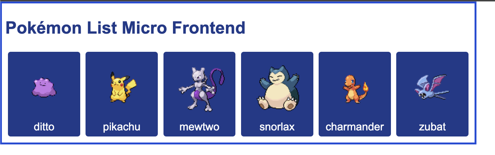
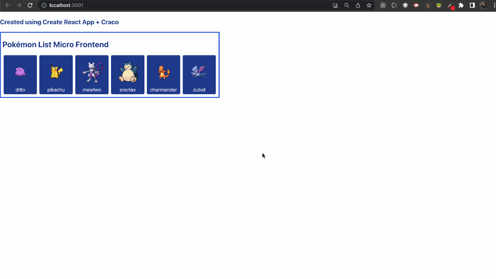
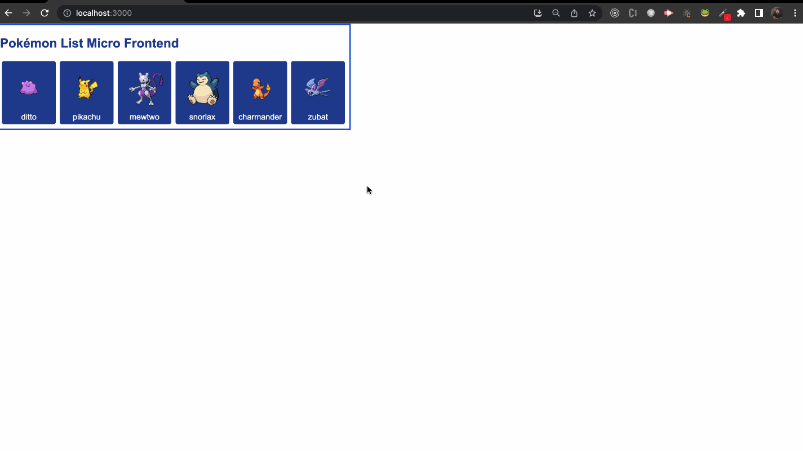
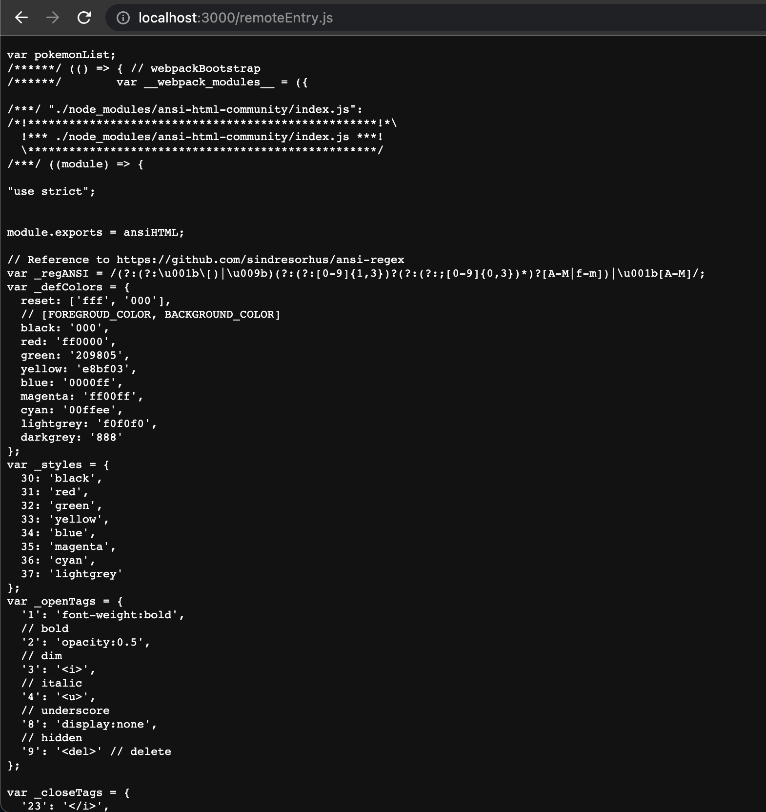

# Pokémon Micro Frontends Module Federation

This project was done to introduce the Micro Front-ends (MF's) using the concept of Runtime Sharing Components and Module Federation with Webpack 5.

Also, the project is using `Jotai` to manage the state of MF.

The project contains two types of projects using React and the Module Federation. One of them is using `Vite` with `originjs/vite-plugin-federation` (vite plugin to configure module federation).

The other is using `Create React App (CRA)` and `Craco` to extends the Webpack default of CRA and configure the module federation.

## The Project

We have two packages, one of them using vite and other using CRA. Each of one contains two projects. The host and remote app.

The "host" is the `pokemons-home` will consume the micro front-end.
The "remote" is the `pokemon-list` where it contains the MF that will be exposed and the state using `jotai` to manage state of MF.

### The Micro Front-end (Remote App)



The MF `pokemon-list` is only listing pokémons fetch API on `mocks` pokemonList.json. It will return a list of pokemóns, with id, name and sprite. Also, the MF manages the state of list of pokémons and if there's some selected, using `Jotai`.

### The Web App (Host App)



The main app (host) will consume the MF and interact with him, using the `jotai` hook exposed to select a pokémon.

### Module Federation

According to the documentation:

>Multiple separate builds should form a single application. These separate builds act like containers and can expose and consume code between builds, creating a single, unified application.

Module federation allow us to expose our components and state. The module federation is available on webpack 5.

The module federation generates a file called `remoteEntry.js` that is the manifest to our application consume and/or expose what we want.



Example of remoteEntry file:



This file is generated after the build of application.

### **Module Federation with Vite**

The vite offers a plugin to integrate with module federation called `originjs/vite-plugin-federation` that you can install and add on your `vite.config.js`

### **Module Federation with Create React App (CRA)**

One of the options to use module federations on CRA app, is using the `craco`. Craco is a tool that "extends" the webpack config to we use the `ModuleFederationPlugin` available on webpack.

We need to create a file called `.cracorc.js` and we can configure plugins on our project.

## Requirements

- Node >= 16.0.0
- NPM or Yarn

I will be using `yarn` to manage our dependencies.

## How to run?

- First, enter some project (vite or CRA).
- We will have two project, the `pokemons-home` and `pokemons-list`.

- First, enter on `pokemons-list`, open the first terminal and type the command:

```
yarn
```

To install the dependencies


If you are on the vite project: 

```sh
yarn build && yarn preview
```

if you are on the CRA project
```sh
yarn build && yarn dev
```

The build will generate the remoteEntry.js and the micro frontend in on air.

- Now, open the second terminal and enter on `pokemons-home` and type:

```sh
yarn
```

And you can just run, using:

```sh
yarn dev
```

Now the host app is available, consuming the micro frontend and allow to interact with the state of component.

If you liked the project, star and share the repository for everyone!!! Thank you, guys!


Created by Kevin Uehara - 2023
